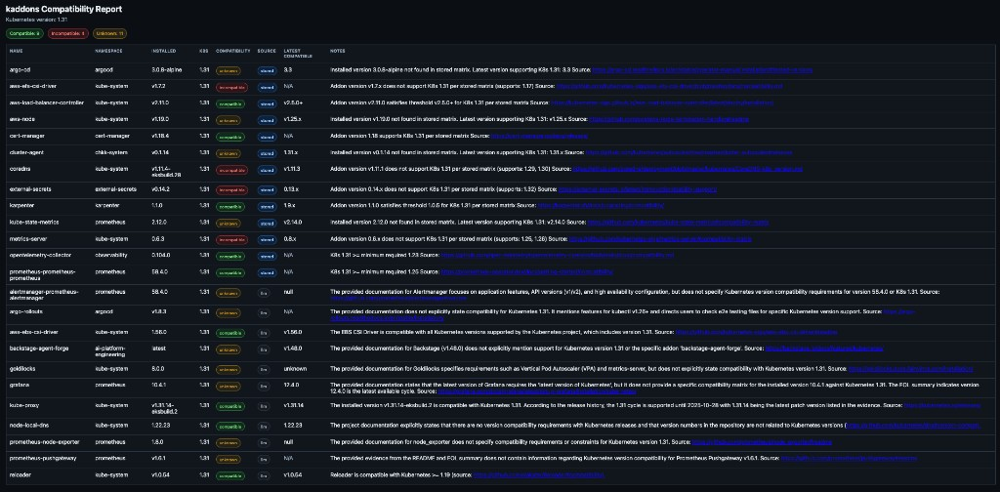

# kaddons

Kubernetes addon compatibility checker. Discovers addons running in any Kubernetes cluster, cross-references them against a curated database of 668 addons, and determine whether each addon is compatible with the cluster's Kubernetes version.

Works with EKS, GKE, AKS, k3s, and any conformant Kubernetes cluster.

## How it works

kaddons uses a three-phase **Plan-and-Execute** pipeline. Phases 1 and 2 are fully deterministic — the same cluster state always produces the same set of addons and fetched data. The LLM is only invoked in Phase 3 to interpret compatibility pages.

```
Phase 1: Discovery        kubectl → detect K8s version + installed workloads
Phase 2: Enrichment       Match against 668-addon DB, resolve stored matrix data first
Phase 3: Analysis         Gemini calls only for addons unresolved by stored data
```

See [docs/architecture.md](docs/architecture.md) for the full data flow.

## Prerequisites

- `kubectl` configured with cluster access
- A [Gemini API key](https://aistudio.google.com/apikey) when runtime LLM analysis is needed

## Install

**Homebrew:**

```bash
brew install qbandev/tap/kaddons
```

**Go install** (requires Go 1.25.7+):

```bash
go install github.com/qbandev/kaddons/cmd/kaddons@latest
```

**Build from source:**

```bash
git clone https://github.com/qbandev/kaddons.git
cd kaddons
make build
# Binary: ./kaddons
```

## Quick start

```bash
export GEMINI_API_KEY=your-key-here

# Scan all addons (JSON output)
kaddons

# HTML report output
kaddons -o html --output-path ./kaddons-report.html

# Check specific addons
kaddons -a cert-manager,karpenter -o html

# Override cluster version
kaddons -c 1.34

# Filter by namespace
kaddons -n kube-system -o html
```

## Flags

| Flag | Short | Default | Description |
|------|-------|---------|-------------|
| `--namespace` | `-n` | `""` (all) | Kubernetes namespace filter |
| `--cluster` | `-c` | `""` (auto-detect) | Kubernetes version override (e.g. `1.30`) |
| `--addons` | `-a` | `""` (all matched) | Comma-separated addon name filter |
| `--key` | `-k` | `""` (falls back to `GEMINI_API_KEY`) | Gemini API key |
| `--model` | `-m` | `gemini-3-flash-preview` | Gemini model |
| `--output` | `-o` | `json` | Output format: `json` or `html` |
| `--output-path` | | `./kaddons-report.html` | Output file path when `--output html` is selected |

## Output

### JSON (default)

```json
{
  "k8s_version": "1.30",
  "addons": [
    {
      "name": "cert-manager",
      "namespace": "cert-manager",
      "installed_version": "v1.14.2",
      "compatible": "true",
      "latest_compatible_version": "1.18",
      "data_source": "stored",
      "note": "The compatibility matrix at https://cert-manager.io/docs/releases/ states v1.14 supports K8s 1.24-1.31. Supported until 2025-09-10."
    },
    {
      "name": "goldilocks",
      "namespace": "kube-system",
      "installed_version": "8.0.0",
      "compatible": "unknown",
      "data_source": "llm",
      "note": "The page at fairwinds.com is a product overview without a version compatibility matrix."
    }
  ]
}
```

The `compatible` field is a tri-state string:
- `"true"` — addon version is confirmed compatible
- `"false"` — addon version is not compatible; check `latest_compatible_version`
- `"unknown"` — compatibility could not be determined

The `data_source` field shows where the verdict came from:
- `"stored"` — deterministic resolver from local stored db
- `"llm"` — runtime Gemini analysis of local stored db and fetched compatibility evidence

The `note` field always cites its source URL and includes support-until dates when available.

### HTML report (`-o html`)

Writes a styled report to `./kaddons-report.html` by default (or to `--output-path` if specified). JSON output remains the default for stdout pipelines.



## Accuracy and limitations

The LLM reads each addon's official compatibility page and extracts version support information. Analysis is deterministic in ordering and context construction, and each addon is evaluated independently with bounded retries/timeouts. It returns `"unknown"` rather than guessing when data is unclear. Results should be treated as a **triage tool** — verify critical decisions against the official documentation linked in each `note` field.

## Documentation

| Document | Description |
|----------|-------------|
| [docs/architecture.md](docs/architecture.md) | Pipeline design, data flow, addon matching algorithm |
| [docs/addon-database.md](docs/addon-database.md) | Database schema, categories, how to add new addons |
| [docs/configuration.md](docs/configuration.md) | Flags, environment variables, output formats |
| [docs/ci-cd.md](docs/ci-cd.md) | CI pipeline, release process, automated link checking |
| [docs/contributing.md](docs/contributing.md) | Development setup, testing, project structure |
| [AGENTS.md](AGENTS.md) | Coding agent instructions for this repository |

## License

MIT. See `LICENSE`.
